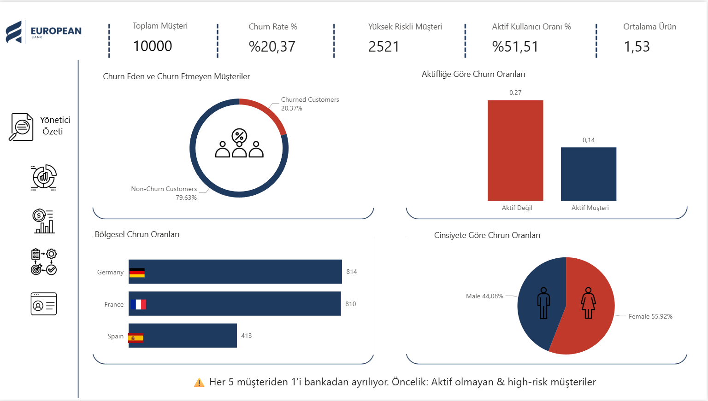
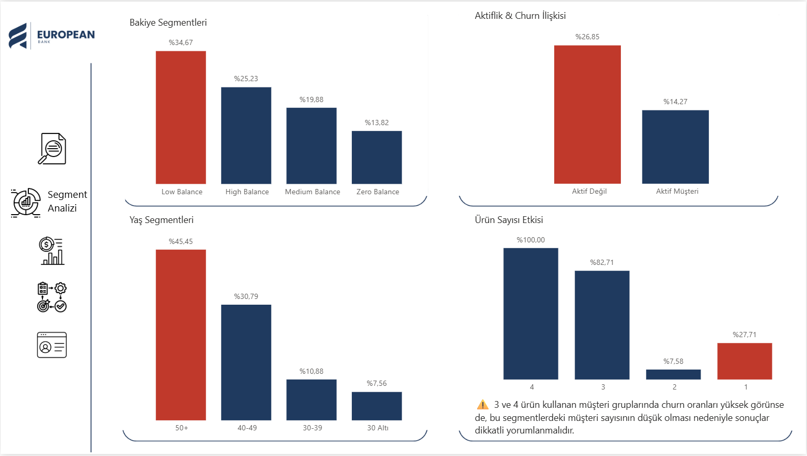
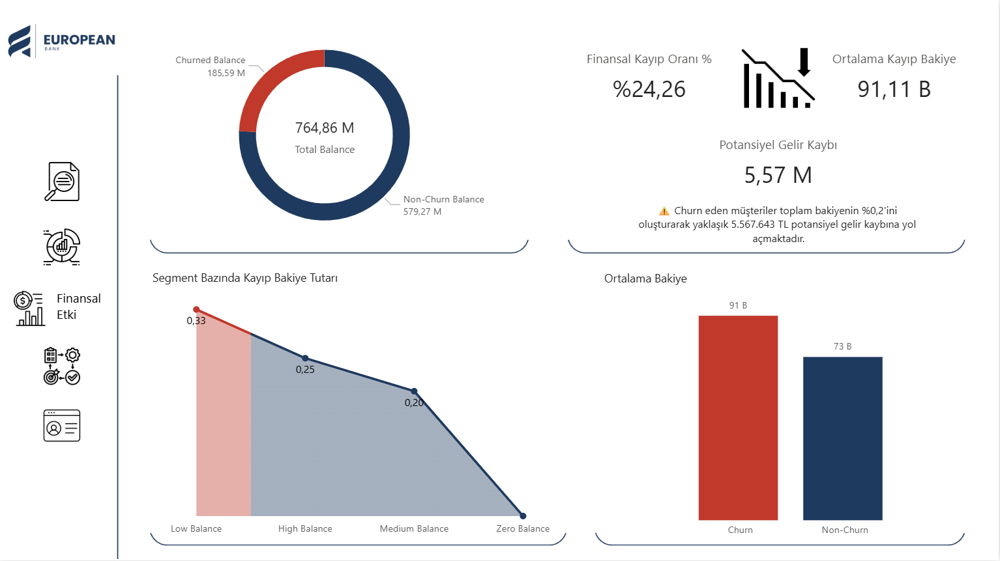
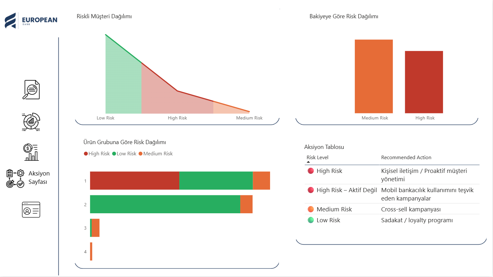
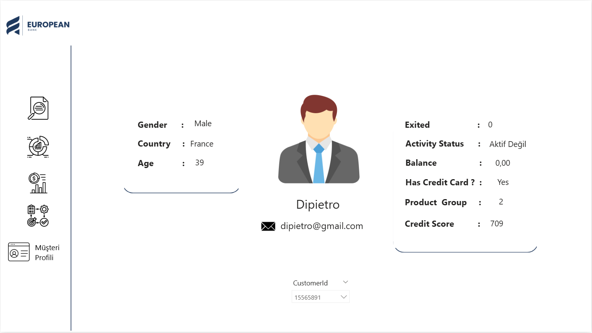

# 🏦 Banka Müşteri Churn Analizi (SQL & Power BI)
## 📌 Proje Özeti
Bu proje, bankacılık sektöründe müşteri kaybını (churn) analiz etmek amacıyla
SQL kullanılarak hesaplamaların yapıldığı ve Power BI ile yönetici seviyesinde
dashboard’ların oluşturulduğu uçtan uca bir analiz çalışmasıdır.

Projenin amacı:
- Churn oranını hesaplamak
- Yüksek riskli müşteri segmentlerini belirlemek
- İş birimleri için aksiyon alınabilir içgörüler sunmak

## 🎯 İş Problemi
Bankalar için müşteri kaybı doğrudan gelir ve kârlılık kaybına yol açmaktadır.

Bu analiz aşağıdaki sorulara yanıt arar:
- Hangi müşteriler churn ediyor?
- Churn riski en yüksek segmentler hangileri?
- Müşteri davranışları churn ile nasıl ilişkilidir?
📎 **Detaylı iş problemi ve varsayımlar:**  
🔗 *Notice dokümanı linki buraya*

## 📊 Hesaplanan Temel Metrikler
- Churn Oranı (%)
- High-Risk Müşteri Oranı
- Churn vs Non-Churn Dağılımı
- Segment Bazlı Churn Analizi
- Bakiye – Churn İlişkisi

## 🛠 Kullanılan Teknolojiler
 
 
 

## 📂 Veri Kaynağı

Bu projede kullanılan müşteri verisi **Maven Analytics – Data Playground**’tan alınmıştır.  
Veri seti aşağıdaki linkten erişilebilir:

🔗 https://mavenanalytics.io/data-playground/bank-customer-churn

> Kaynak: *Maven Analytics Data Playground – Bank Customer Churn Dataset*
## 📝 Detaylı Analiz ve Dokümantasyon

Bu projeye ait:
- Veri seti açıklamaları  
- Churn tanımı ve varsayımlar  
- SQL hesaplama mantıkları  
- Power BI KPI yorumları  
- İş birimleri için öneriler  

tek bir dokümanda toplanmıştır.

🔗 **Notice Dokümanı:**  
[https://notice.site/your-notice-link](https://www.notion.so/Bank-Customer-Churn-Analysis-2e8902ccbf278068bad9d10b055c3688)

---
## 🔍 Churn Tanımı
Bu projede bir müşteri aşağıdaki koşulları sağlıyorsa **churn** olarak tanımlanmıştır:

- `IsActiveMember = 0`
- İncelenen dönemde aktif işlem yapmaması

## 📊 KPI Sonuçları

### 🔹 Churn Oranı

> Toplam 10.000 müşteri incelenmiştir.
2.037 müşteri churn etmiş olup genel churn oranı %20,37’dir.
Bu oran, müşteri kaybının anlamlı bir seviyede olduğunu ve churn analizi yapılmasının gerekli olduğunu göstermektedir.

### 🔹 Aktiflik Durumuna Göre Churn

> Aktif olmayan müşterilerde churn oranı %26,85 iken,
aktif müşterilerde bu oran %14,27’dir.
Bu sonuç, müşteri aktifliğinin churn riskini önemli ölçüde azalttığını ve
müşteri etkileşimini artırmaya yönelik stratejilerin kritik olduğunu göstermektedir.
### 🔹 Ürün Sayısına Göre Churn

> 1 ürüne sahip müşterilerde churn oranı %27,71 iken,
2 ürüne sahip müşterilerde bu oran %7,58’e düşmektedir.
3 ve 4 ürüne sahip müşteri sayısı düşük olmasına rağmen churn oranlarının çok yüksek olması, bu segmentlerin yüksek riskli olduğunu ve özel olarak analiz edilmesi gerektiğini göstermektedir.
### 🔹 Ürün Sayısına Göre Churn

>30 yaş altı ve 30–39 yaş gruplarında churn oranı görece düşük seviyededir.
40–49 yaş grubunda churn oranı %30,79’a, 50+ yaş grubunda ise %45,45’e yükselmektedir.
Bu bulgu, yaş ilerledikçe churn riskinin arttığını ve özellikle ileri yaş segmentleri için hedefli müşteri tutundurma stratejilerinin gerekli olduğunu göstermektedir.
### 🔹 Bakiye Segmentine Göre Churn

>Zero Balance müşterilerde churn oranı %13,82 ile en düşük seviyededir.
Medium Balance segmentinde churn oranı %19,88 iken, High Balance müşterilerde %25,23’e yükselmektedir.
Low Balance segmentinde müşteri sayısı düşük olmasına rağmen churn oranının %34,67 olması, bu grubun yüksek riskli bir segment olduğunu göstermektedir.
### 🔹 Yüksek Riskli Müşteriler

> Analiz sonucunda toplam 2.521 müşteri high-risk segmentinde yer almaktadır.
Bu müşteri grubu, churn riskini azaltmaya yönelik hedefli aksiyonlar için öncelikli olarak ele alınmalıdır.

## 📈 Power BI Dashboard’ları
Oluşturulan Power BI raporları aşağıdaki sayfalardan oluşmaktadır:

- **Yönetici Özeti**

- **Segment Analizi**

- **Finansal Etki**

- **Aksiyon Sayfası**

- **Müşteri Profili**

Dashboard ekran görüntüleri `/powerbi/dashboard_screenshots/` klasöründe yer almaktadır.

---

## 💡 Öne Çıkan İçgörüler
- Churn oranı %20’nin üzerindedir, bu da her 5 müşteriden 1’inin bankadan ayrılma riski taşıdığını göstermektedir. Bu seviye bankacılık sektörü için yüksek churn riski olarak değerlendirilmektedir.

- Aktif olmayan müşterilerde churn olasılığı anlamlı şekilde daha yüksektir. Özellikle IsActiveMember = 0 olan müşteri grubunda churn yoğunlaşmaktadır. Bu durum, müşteri etkileşiminin churn üzerindeki kritik rolünü göstermektedir.

- Düşük bakiye segmentindeki müşteriler churn etmeye daha yatkındır. Bakiye arttıkça churn oranının azaldığı gözlemlenmiştir. Bu bulgu, finansal bağlılığın müşteri sadakatini artırdığını göstermektedir.

- Tek ürün kullanan müşteriler, çoklu ürün kullanan müşterilere kıyasla daha yüksek churn riski taşımaktadır. Ürün çeşitliliği arttıkça churn oranı düşmektedir.

- Belirli yaş segmentlerinde churn yoğunlaşması görülmektedir. Özellikle orta yaş ve üzeri müşteri gruplarında churn oranı ortalamanın üzerindedir. Bu segmentler için hedefli müşteri tutundurma stratejileri gereklidir.

- Coğrafi segmentler arasında churn davranışı farklılık göstermektedir. Bazı bölgelerde churn oranı belirgin şekilde daha yüksektir; bu durum bölgesel müşteri deneyimi veya ürün uyumsuzluğu ile ilişkilendirilebilir.

- Kredi kartına sahip olmayan müşteriler churn etmeye daha yatkındır. Bu da ek ürün sahipliğinin müşteri bağlılığı üzerinde olumlu etkisi olduğunu desteklemektedir.

- Yüksek churn riski taşıyan müşteriler, toplam müşteri kitlesinin azınlığını oluştursa da potansiyel gelir kaybının önemli bir kısmını temsil etmektedir. Bu nedenle erken uyarı mekanizmaları kritik önemdedir.

